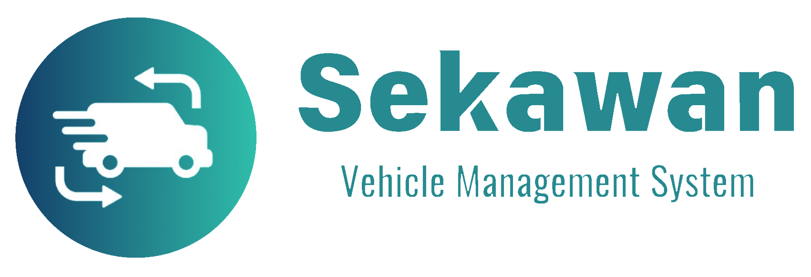
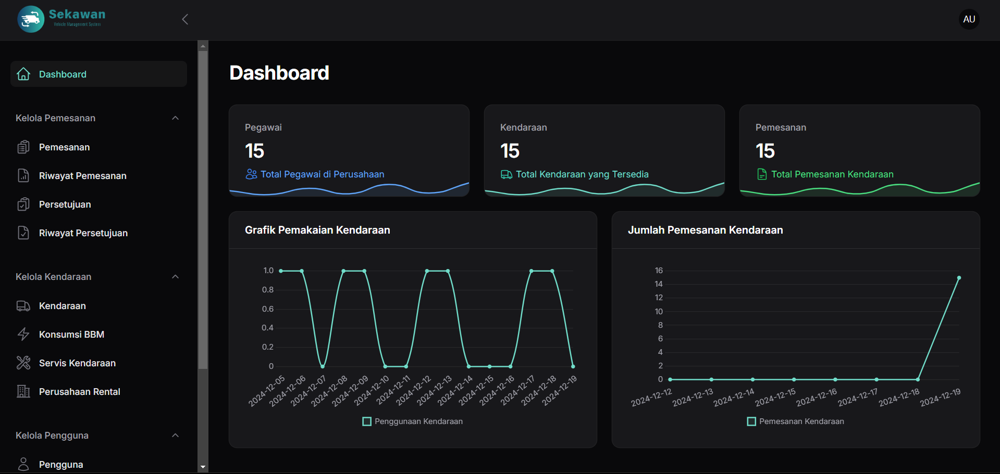
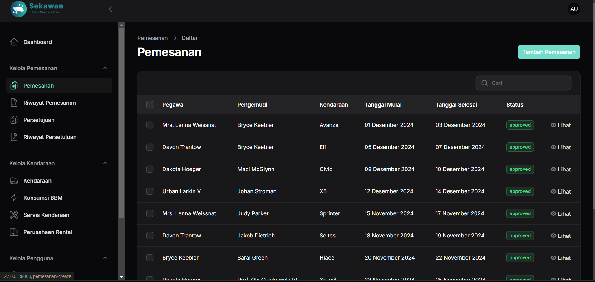
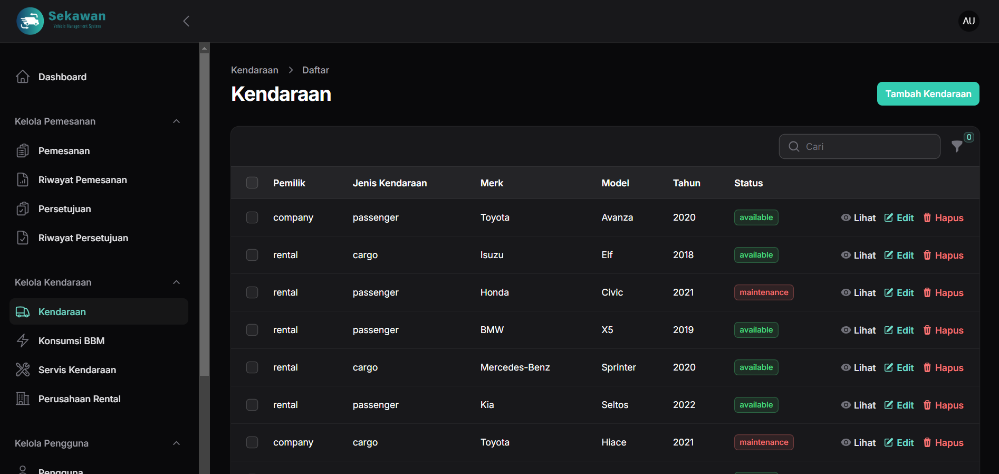
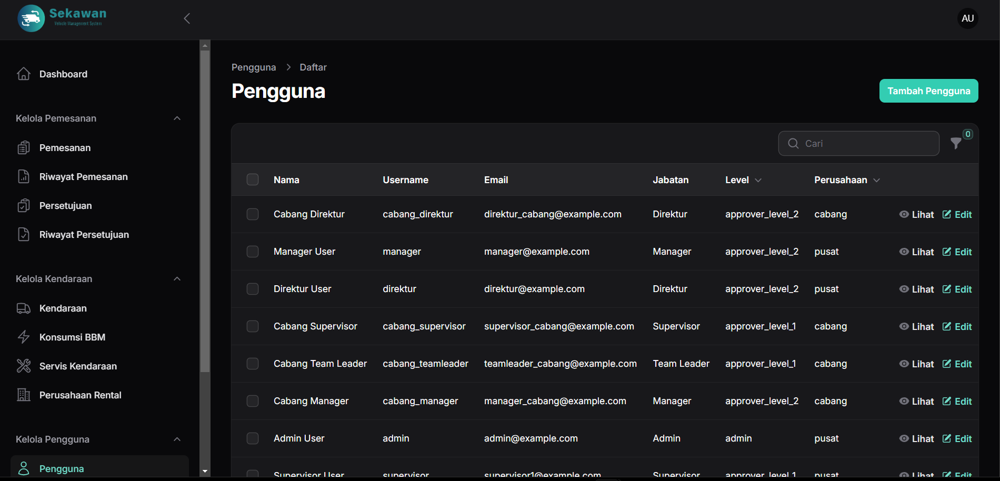
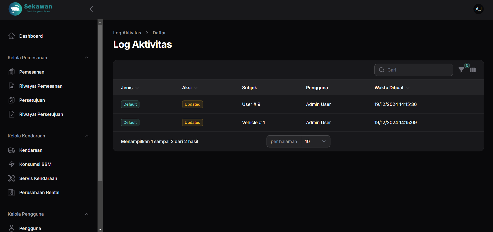

# Manual Book Website Pengelolaan Peminjaman Kendaraan Perusahaan

## Pendahuluan
Website ini dirancang untuk memonitor kendaraan yang dimiliki perusahaan, mencatat konsumsi BBM, jadwal servis, riwayat pemakaian kendaraan, serta proses pemesanan kendaraan. Website ini terdiri dari dua jenis pengguna, yaitu **Admin** dan **Approver**.

---

## Informasi Aplikasi

### Akun Login
Berikut adalah daftar username dan password default untuk mengakses aplikasi:

| Username       | Password    | Role      |
|----------------|-------------|-----------|
| admin          | 12345    | Admin     |
| supervisor      | 12345  | Approver Level 1 |
| teamleader      | 12345  | Approver Level 1 |
| manager      | 12345  | Approver Level 2 |
| direktur      | 12345  | Approver Level 2 |
| cabang_supervisor      | 12345  | Approver Level 1 |
| cabang_teamleader      | 12345  | Approver Level 1 |
| cabang_manager      | 12345  | Approver Level 2 |
| cabang_direktur      | 12345  | Approver Level 2 |

### Versi Teknologi
- **Database**: 8.0.30 - MySQL Community Server - GPL
- **PHP**: 8.3.3
- **Framework**: Laravel Framework 11.35.0 + Filament 3.x

---

## Fitur Utama

### **Dashboard**

Menampilkan:
- **Statistik Singkat**:
  - Jumlah Pegawai 
  - Total Kendaraan 
  - Jumlah Pemesanan 
- **Grafik Pemakaian Kendaraan**: Line chart yang menunjukkan jumlah pemakaian kendaraan per 2 Minggu.
- **Grafik Pemesanan Kendaraan**: Line chart yang menunjukkan jumlah pemesanan kendaraan per Minggu.

---

### **Kelola Pemesanan**

- **Admin**:
  - Membuat pemesanan kendaraan.
  - Menentukan driver, tanggal, dan pihak yang menyetujui.
- **Approver**:
  - Menyetujui atau menolak pemesanan.
  - Level persetujuan (Level 1 dan Level 2).

---

### **Kelola Kendaraan**

- Menambah, mengedit, dan menghapus data kendaraan.
- Mengelola:
  - **Data Rental**: Perusahaan penyedia kendaraan rental.
  - **Riwayat BBM**: Konsumsi bahan bakar kendaraan.
  - **Jadwal Servis**: Catatan jadwal perawatan kendaraan.

---

### **Kelola Pengguna**

- Admin dapat mengelola data user dan pegawai:
  - Menambah dan mengedit data pengguna.
  - Mengatur jabatan (Admin, Approver, atau Driver).

---

### **Log Aktivitas**

- **Log Aktivitas**:
  - Menyimpan dan menampilkan aksi yang dilakukan oleh user

---

## Panduan Penggunaan Aplikasi

### 1. **Login**
- Masukkan **username** dan **password**.

### 2. **Dashboard**
- Lihat statistik singkat dan grafik.

### 3. **Kelola Pemesanan**
#### Admin:
1. Klik **Tambah Pemesanan**.
2. Isi form pemesanan: 
   - Pemesan dan Pengemudi.
   - Jenis Kendaraan: Cargo/Passenger.
   - Pemilik Kendaraan: Perusahaan/Rental.
   - Tanggal
   - Tipe Kendaraan
   - Tentukan Approver Level 1 dan Level 2.
3. Klik **Submit**.

#### Approver:
1. Masuk ke menu **Kelola Persetujuan**.
2. Lihat daftar pemesanan yang membutuhkan persetujuan.
3. Klik **Setujui** atau **Tolak**.

### 4. **Kelola Kendaraan**
1. Pilih menu **Data Kendaraan**.
2. Tambah/Edit kendaraan:
   - Nomor Polisi.
   - Tipe Kendaraan.
   - Pemilik (Perusahaan/Rental).
   - Status: Available, Maintenance.

### 5. **Kelola Pengguna**
1. Masuk ke menu **Kelola Pengguna**.
2. Tambah/Edit data user.

### 6. **Laporan Pemesanan**
1. Pilih menu **Riwayat Pemesanan**.
2. Filter data berdasarkan tanggal.
3. Klik **Ekspor ke Excel**.

---
